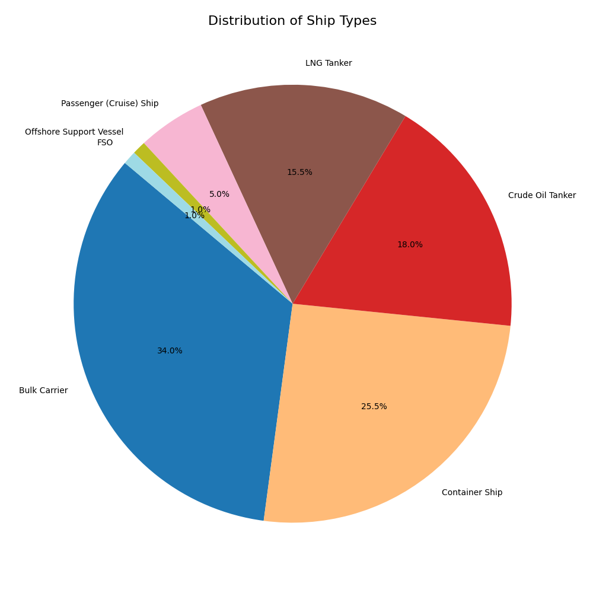
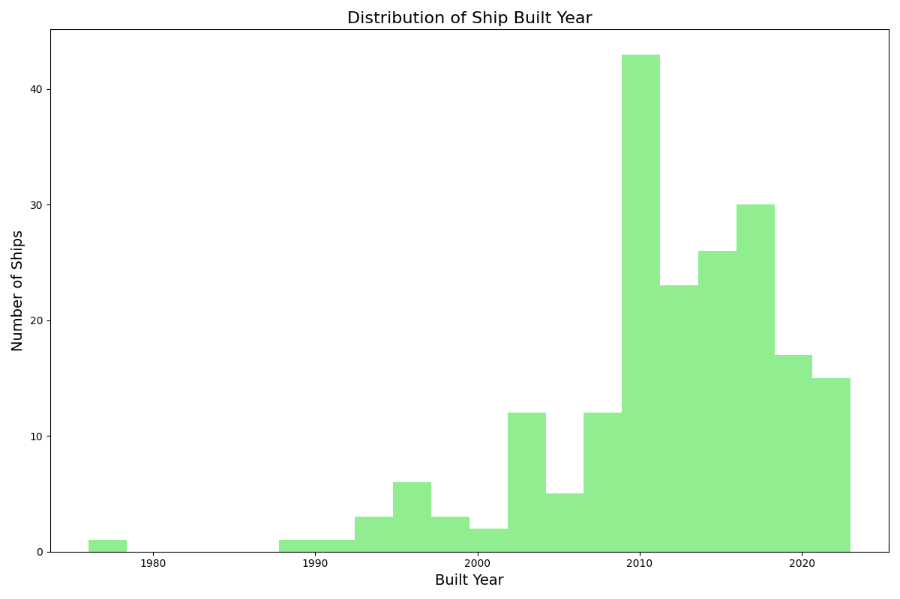
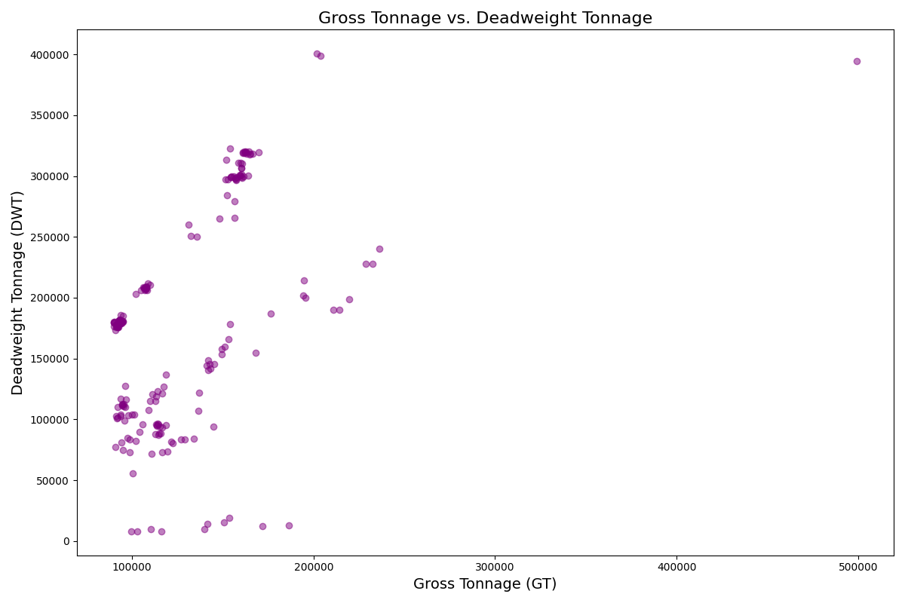
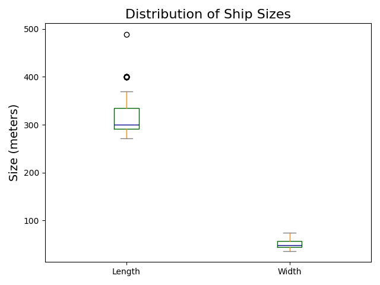
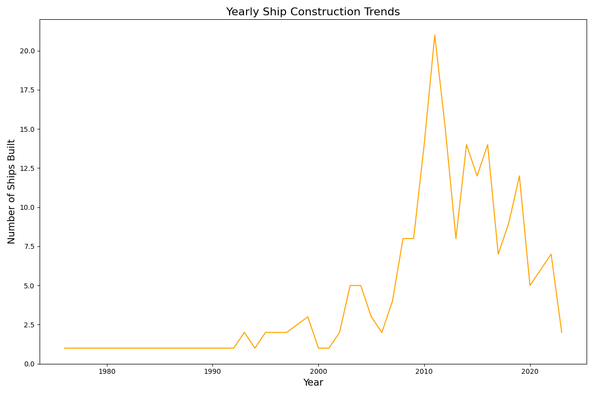
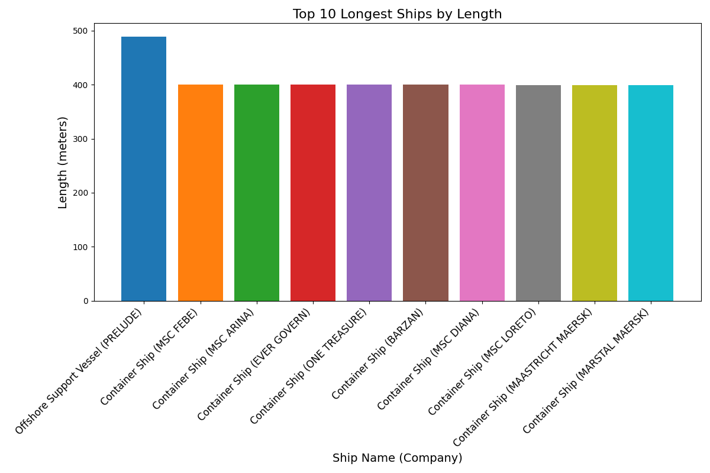

# ETL Project

This project analyzes cargo ship data, providing insights into various attributes such as ship types, sizes, and construction trends. The project includes an ETL pipeline that processes the data and generates visualizations.

## Project Structure

- **data/**: Contains the CSV file with ship data and generated visualizations.
- **postgresql/**: Contains database-related configurations and scripts.
- **python/**: Contains the ETL script and related Python files.
- **docker-compose.yml**: Configuration for running the project using Docker.

## Dataset

The dataset includes the following attributes for each ship:

- **Company_Name**: The ship's private name.
- **Ship_Name**: Name of the ship.
- **Built_Year**: Year the ship was built.
- **GT (Gross Tonnage)**: A measure of the ship's overall internal volume.
- **DWT (Deadweight Tonnage)**: Maximum weight a ship can safely carry.
- **Length**: Length of the ship.
- **Width**: Width of the ship.

## Visualizations

The project generates several visualizations, including:

1. **Distribution of Ship Types**: Pie chart.
   

2. **Distribution of Ship Built Years**: Histogram.
   

3. **Gross Tonnage vs. Deadweight Tonnage**: Scatter plot.
   

4. **Distribution of Ship Sizes**: Box plot.
   

5. **Yearly Ship Construction Trends**: Line chart.
   

6. **Top 10 Longest Ships by Length**: Bar chart.
   

## Setup and Usage

1. **Clone the Repository**:
   ```bash
   git clone https://github.com/yourusername/ETL_Project.git
   cd ETL_Project

### Key Points

- **`docker-compose up --build`:** Builds and starts the containers, ensuring any changes are applied.
- The Analysis results are populated in data directory which is on host machine in the same directory wiyh yaml file. (pgdata needs root access to view the files because it is a database)
